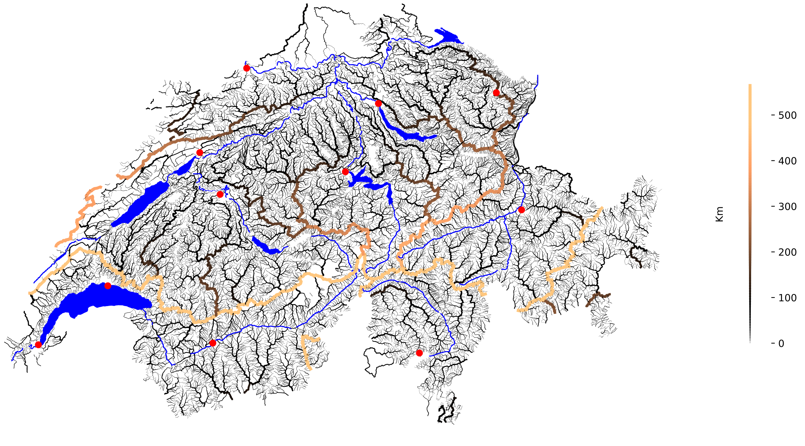

# SwissWatershed
Plotting all watersheds in Switzerland from official data sources
## Overview

The low-resolution preview above might look like it shows all the rivers and brooks in Switzerland, but most of it is quite the opposite: It shows the locations of all watersheds in the country.
### Watershed
A watershed is the line separating the basins that two rivers draw their water from. On the one side of the line, water will flow into one and on the other side into the other river. 
### Separation
The separation of two small neighboring rivers probably will be very temporary: a few kilometers downstream they might merge into the same parent river. *This project calculates for all watersheds, local and global, the strength of the separation they enforce*. I define it as the length the water must travel down both of the separated rivers until they meet again. Where they merge into the oceans at different locations, the distance between the points where they flow into the ocean is added. _Note some caveats below!_.
### Plot
The plot indicates the separation of each watershed by line thickness and color. The result is rendered in vector format, stored as a .svg file. That means much more detail is visible than in the included low-resolution preview. 
## Caveats
Since my data source covers only Switzerland, I can only follow a stream until it leaves the country, and not all the way to the ocean. Therefore, as a drastic simplicification, I "assume" that the country is an island entirely surrounded by ocean. (There's a joke about Switzerland being an island within the EU here, but I can't quite find it.)

This issue is most visible where the separation of the main European watershed between Rhine and Rhone is drastically underestimated.

I might solve this in future releases.

## Generating the plot
### Data sources
Data sources. To run this, you will need some data that is freely available from the pages Swiss Federation. (TODO: Add links here)

### Requirements
(TODO: document)

### Running it
(TODO: document)